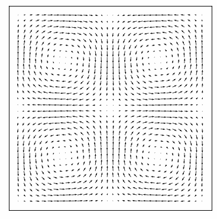

# StableFluids-python

A pure-python implementation of Stable Fluids with stagger grids.

## Demo examples

| | Taylor–Green vortex        | Vortexsheet           | 
|--| :------------------------: |:-------------:| 
|Command| ```python run.py -c configs/taylorgreen.json```      | ```python run.py -c configs/vortexsheet.json``` | 
|Visualization| velocity      | density      | 
||  |  | 
| | **Kármán vortex street**       | **Inflow**           | 
|Command| ```python run.py -c configs/karman.json```      | ```python run.py -c configs/inflow.json``` | 
|Visualization| curl(vorticity)      | R: curl, G: 1, B: density      | 
||  |  | 

To setup new examples, simply add a cooresponding python file under `examples` folder.

## Reference
- [Joe Stam's Stable Fluid paper](https://pages.cs.wisc.edu/~chaol/data/cs777/stam-stable_fluids.pdf)
- [Course material from Columbia Computer Animation course](http://www.cs.columbia.edu/~cxz/teaching/w4167_f21/#)
- [GregTJ's git repo](https://github.com/GregTJ/stable-fluids)